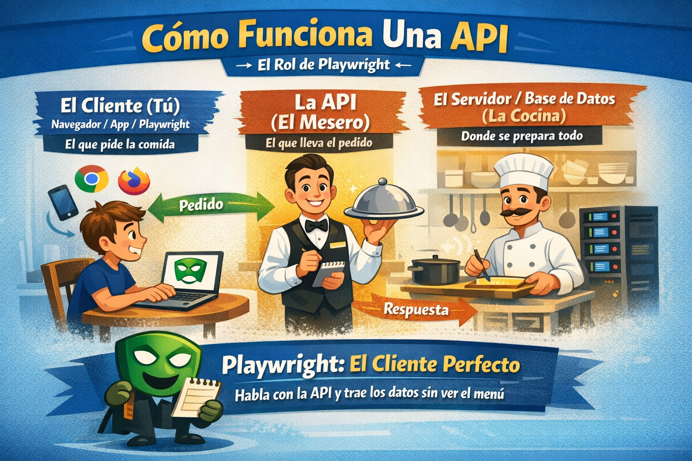
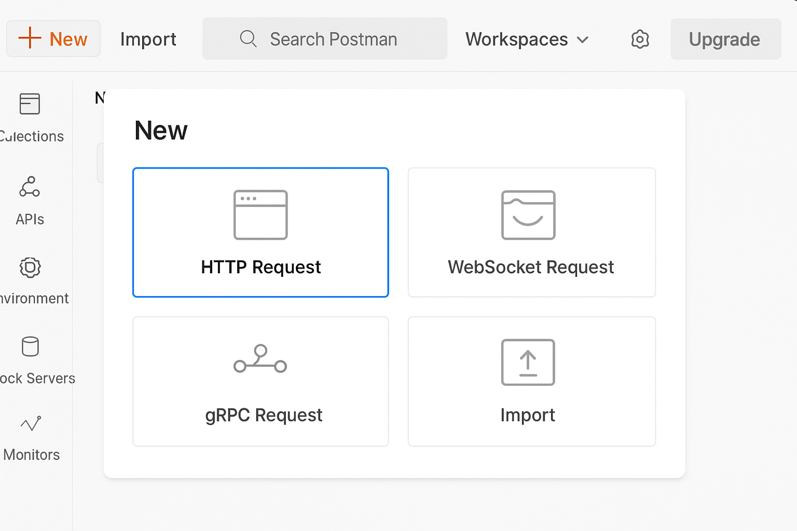
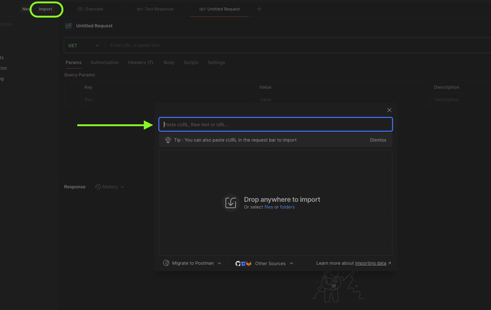
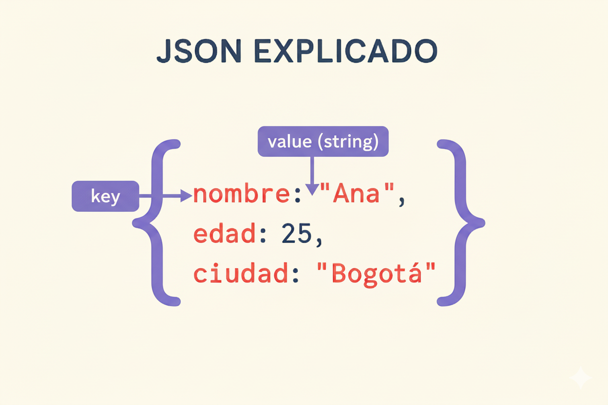
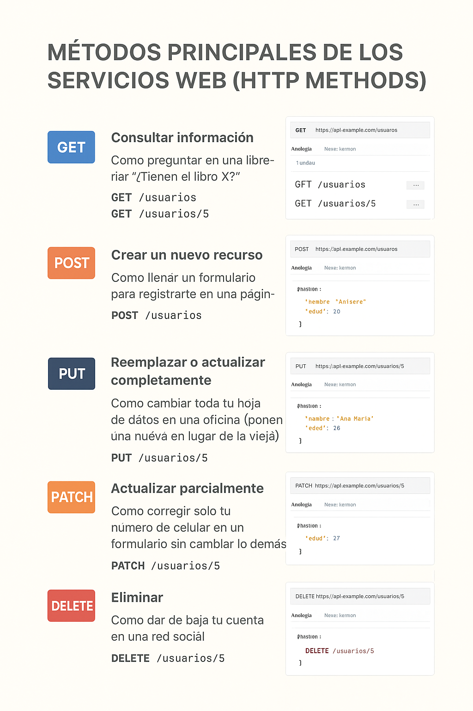

# 🌱 Warm Up #1 – Configuración inicial y herramientas necesarias

En este calentamiento, el aprendiz se preparará para comenzar con la automatización de APIs usando **Playwright**.  
Se enfocará en instalar y configurar todas las herramientas necesarias, así como familiarizarse con **Postman** para explorar y probar APIs antes de automatizarlas.

---

##  Index
1. [¿Qué es Playwright y por qué usarlo?](#qué-es-playwright-y-por-qué-usarlo) (Tiempo de lectura: 4 minutos)
2. [Arquitectura y componentes](#arquitectura-y-componentes) (Tiempo de lectura: 5 minutos)
3. [Instalación de herramientas previas](#instalación-de-herramientas-previas) (Tiempo de lectura: 5 minutos)
4. [Crear proyecto inicial](#crear-proyecto-inicial) (Tiempo de lectura/practica: 16 minutos)
5. [Introducción al API Testing con Postman](#introducción-al-api-testing-con-postman)  (Tiempo de practica: 12 minutos)
6. [Introducción a JSON](#introducción-a-json)  (Tiempo de practica: 5 minutos)
7. [Métodos principales de los servicios web (HTTP Methods)](#métodos-principales-de-los-servicios-web-http-methods) (Tiempo de lectura/practica: 8 minutos)
8. [Códigos de Estado](#códigos-de-estado) (Tiempo de lectura/practica: 15 minutos)
9. [Introducción a JavaScript para Testers](#introducción-a-javascript-para-testers) (Tiempo de lectura/practica: 15 minutos)
10. [Quick Task](#quick-task)(Tiempo de lectura/practica: 35 minutos) 

> Total aproximado: 1 hora y 55 minutos.


---

## ¿Qué es Playwright y por qué usarlo?

¡Bienvenido al mundo de la automatización! Quizás hayas escuchado que Playwright es una herramienta increíble para automatizar navegadores web (hacer clics, llenar formularios, etc.). 
Y es verdad, es el rey actual en eso.

>Pero, ¿por qué usar Playwright para probar APIs si no es su enfoque principal?

Imagina que pruebas una tienda online. El proceso normal es: iniciar sesión, buscar un producto, agregarlo al carrito y pagar. Si haces esto desde la pantalla (UI) cada vez, tu prueba tardará minutos.

- **El superpoder de Playwright:** Te permite usar la API para "crear el carrito y hacer el pago" en milisegundos por detrás de escena (Back-end), y luego usar la automatización web solo para verificar que el mensaje de "Compra exitosa" aparece en la pantalla.

Usar Playwright para APIs te permite crear pruebas híbridas: veloces, estables y súper poderosas, todo sin cambiar de herramienta.

### Ventajas clave:
- Soporte multinavegador real.
- Fácil integración con CI/CD.
- Soporta pruebas paralelas y múltiples contextos.
- Permite control completo del navegador y red.

---

## Arquitectura y componentes

No te asustes con la palabra "arquitectura". Piénsalo como un restaurante:

- **El Cliente (Tú)**: Es el navegador web, una app móvil o nuestro código de Playwright. Es quien pide la comida.
- **La API (El Mesero)**: Es el mensajero. Toma tu pedido, lo lleva a la cocina y te trae la comida (o te dice que ya no hay).
- **El Servidor/Base de Datos (La Cocina)**: Es donde se prepara y guarda todo.

Playwright actúa como el cliente perfecto. Sabe exactamente cómo hablarle al "mesero" (API) para pedirle datos, modificarlos o borrarlos sin tener que sentarse a leer el menú (interfaz gráfica).




---
## Instalación de herramientas previas

Antes de iniciar el proyecto, asegúrate de tener las siguientes herramientas instaladas. A continuación, se indican los pasos para descargarlas y cómo validar su instalación correctamente desde la terminal.

### Gitbash (windows)

[Link de descarga](https://git-scm.com/install/windows)

###  **Node.js**
- Versión recomendada: LTS
- [Descarga aquí](https://nodejs.org/es/download)

**Validación:**
```bash
node -v
npm -v
```
Ambos comandos deben devolver un número de versión, por ejemplo:
```
v18.17.1
9.6.7
```


### **Git**
- Control de versiones y gestión del código fuente.
- Descarga desde: [https://git-scm.com](https://git-scm.com)

**Validación:**
```bash
git --version
```
Debe mostrar algo como:
```
git version 2.40.1
```


###  **Editor de código**
- Recomendado: Visual Studio Code
- [https://code.visualstudio.com](https://code.visualstudio.com)

**Validación (opcional):**
Abre la terminal y ejecuta:
```bash
code --version
```
Esto confirmará que `VS Code` está disponible en tu terminal (requiere que hayas marcado la opción *"Add to PATH"* durante la instalación).

> Si todas las herramientas están correctamente instaladas y validadas, ¡estás listo para crear tu primer proyecto con Playwright!

---

---

## Crear proyecto inicial

¡Manos a la obra! Vamos a crear tu primer proyecto. No escribiremos código desde cero, le pediremos a Playwright que arme la estructura por nosotros.

Abre VS Code, abre una terminal (una ventana para dar órdenes a tu computadora) y escribe:

```bash
npm init playwright@latest qax-project-automation-apis-playwright
```
- Este comando mágico descarga Playwright, crea carpetas ordenadas y te deja un ejemplo listo para funcionar. ¡Felicidades, ya tienes tu entorno de Automation!


### ¿Quieres agregar Playwright Test (el test runner)?

```bash
✔ Do you want to use Playwright Test to run your tests? 
```
> Di que SÍ.`Enter`

### Runner

El “Playwright Test Runner” es lo que ejecuta tus pruebas y genera reportes.

```bash
✔ Add a GitHub Actions workflow? (Y/n)
```
> `False` Solo practicarás localmente por ahora.

```bash
 Install Playwright browsers (can be done manually via 'npx playwright install')
```
> `No` No necesitamos instalar los navegadores.

Después de responder las preguntas, Playwright descargará todo lo necesario.
Verás algo como esto:

```
Initializing NPM project (npm init -y)…

{
  "name": "qax-project-automation-apis-playwrright",
  "version": "1.0.0",
  "main": "index.js",
  "scripts": {
    "test": "echo \"Error: no test specified\" && exit 1"
  },
  "keywords": [],
  "author": "",
  "license": "ISC",
  "description": ""
}

```
---

## Introducción al API Testing con Postman

Antes de automatizar, debemos entender qué estamos automatizando. 
Como tester manual, Postman será tu mejor amigo. Postman es una herramienta visual (con botones y pantallas) que nos permite hablar con las APIs sin saber programar.

El **API Testing** (pruebas de APIs) consiste en verificar que los servicios que exponen los sistemas (normalmente en formato **REST** o **SOAP**) funcionen correctamente.  
Con este tipo de pruebas comprobamos que los **endpoints** (rutas URL que responden a peticiones) devuelvan lo esperado: datos correctos, tiempos adecuados y errores bien gestionados.  

Una de las herramientas más usadas para esto es **Postman**.  

### 1. Instalación de Postman  

Tienes dos formas de usar Postman:  

### 🔹 Opción 1: Aplicación de escritorio  
1. Ve a la página oficial: [postman](https://www.postman.com/downloads/)  
2. Descarga la versión para tu sistema operativo (Windows, Mac o Linux).  
3. Instala la aplicación y crea una cuenta gratuita (necesaria para guardar colecciones en la nube).  

### 🔹 Opción 2: Cliente Online (sin instalar nada)  
1. Ingresa a [a la version web](https://identity.getpostman.com/signup?continue=https%3A%2F%2Fgo.postman.co%2Fhome)
2. Haz clic en **Sign In** o **Sign Up** para registrarte.  
3. Podrás usar Postman directamente en tu navegador con las mismas funcionalidades principales.  


### 2. Crear tu primer request  

Un **request** es una solicitud que haces a una API (ejemplo: pedir usuarios, crear un registro, etc.).  

1. Abre Postman.  
2. Haz clic en **New → HTTP Request**.  



3. Elige el método HTTP (ejemplo: `GET`, `POST`, `PUT`, `DELETE`).  
4. Escribe la URL de la API. Ejemplo: https://jsonplaceholder.typicode.com/posts
5. Haz clic en **Send**.  
6. Verás la respuesta de la API en la parte inferior (normalmente en formato **JSON**).  

5. Haz clic en **Send**.  
6. Verás la respuesta de la API en la parte inferior (normalmente en formato **JSON**).  


### 3. Importar una colección en Postman  

Una **colección** es un conjunto de requests organizados (por ejemplo: login, creación de usuario, eliminación, etc.).  
Esto permite compartir pruebas fácilmente dentro de un equipo.  

### Pasos para importar una colección:  
1. Descarga o copia el enlace de la colección (generalmente un archivo `.json`).  
2. En Postman, haz clic en **Import** (arriba a la izquierda).  
3. Selecciona el archivo `.json` o pega el link de la colección.  
4. Haz clic en **Import**.  
5. Verás la colección lista en el panel lateral, lista para ejecutar las pruebas.  



### 4. Uso de Variables en Postman  

Las **variables** en Postman permiten reutilizar valores sin tener que escribirlos manualmente en cada petición. Esto hace que nuestras pruebas sean más dinámicas y fáciles de mantener.  

#### 1️⃣ Variables Globales  
- Están disponibles en **todas las colecciones y ambientes**.  
- Se usan para valores comunes que no cambian (ej: URL base de la API).  

#### Ejemplo:  
```http
{{baseUrl}}/users
```
> Defínela en: Postman → Manage Variables → Global Variables.

#### 2️⃣ Variables por Ambiente

Útiles cuando tienes múltiples entornos (ej: desarrollo, QA, producción).

Cada ambiente puede tener distintos valores para las mismas variables.

#### Ejemplo:

- Ambiente DEV → baseUrl = https://api.dev.miapp.com

- Ambiente PROD → baseUrl = https://api.miapp.com

En la petición:
```http
{{baseUrl}}/login
```
> Según el ambiente seleccionado, Postman reemplazará automáticamente la variable.

---

## Introducción a JSON

Cuando los humanos hablamos, usamos español o inglés.
Cuando los sistemas hablan entre sí a través de una API, el idioma más popular es el JSON (JavaScript Object Notation).

No es un lenguaje de programación, es solo un formato de texto para organizar datos. 

>Se ve como un diccionario de "Llave" y "Valor".

JSON significa **JavaScript Object Notation**.  
Es un **formato de texto** muy usado para enviar y recibir información entre aplicaciones, especialmente en las APIs.  

###  ¿Cómo se ve un JSON?
Un JSON está compuesto por **pares clave – valor**.  
Ejemplo sencillo:  

```json
{
  "nombre": "Ana",
  "edad": 25,
  "ciudad": "Bogotá"
}
```
- "nombre" → es la clave

- "Ana" → es el valor

Los valores pueden ser texto, números, true/false, listas o incluso otros objetos.

### Tipos de datos en JSON

#### Texto (string):
```json
"lenguaje": "JavaScript"
```

#### Número:
```json
"edad": 30
```

#### Booleano (verdadero/falso):
```json
"activo": true
```

#### Lista (array):
```json
"frutas": ["manzana", "banana", "naranja"]
```

#### Objeto dentro de otro objeto:
```json
"usuario": {
  "id": 1,
  "nombre": "Carlos"
}
```
#### Un array de objectos dentro de otro objeto:
```json
{
  "usuarios": [
    {
      "id": 1,
      "nombre": "Ana",
      "email": "ana@example.com",
      "activo": true
    },
    {
      "id": 2,
      "nombre": "Carlos",
      "email": "carlos@example.com",
      "activo": false
    },
    {
      "id": 3,
      "nombre": "Laura",
      "email": "laura@example.com",
      "activo": true
    }
  ]
}

```
- "usuarios" → es la clave principal.

- [ ... ] → los corchetes indican que es un array (lista).

- { ... } → cada elemento dentro de la lista es un objeto con sus propias claves y valores.

- En este ejemplo hay 3 usuarios, cada uno con id, nombre, email y activo.

#### Ejemplo solo con JSON, partiendo de un array
```json
[
  { "title": "Primer post", "body": "Contenido A", "userId": 1 },
  { "title": "Segundo post", "body": "Contenido B", "userId": 2 },
  { "title": "Tercer post", "body": "Contenido C", "userId": 3 }
]
```
##### Los corchetes []

- Nos indican que esto es un array.

- Un array es como una lista ordenada de elementos.

- Piensa en una fila de cajas, donde cada caja tiene algo adentro.

##### Cada caja del array es un objeto {}

- Dentro de los corchetes hay 3 objetos, separados por comas.

- Los objetos en JSON siempre van entre llaves { }.

- Cada objeto puede tener varias propiedades.

### ¿Dónde se usa JSON?

- En las respuestas de las APIs cuando pedimos datos.

- En los cuerpos de las peticiones cuando enviamos información.

- Para guardar configuraciones en muchos programas y frameworks.

### Ventajas de JSON

- Es fácil de leer por humanos.

- Es ligero y rápido de transmitir.

- Lo entienden casi todos los lenguajes de programación.



---

## Métodos principales de los servicios web (HTTP Methods)

Cuando probamos o consumimos un servicio web (API), usamos **métodos HTTP**.  
Estos métodos son como **acciones** que le pedimos al servidor que ejecute sobre un recurso (ejemplo: usuarios, productos, pedidos).  

###  GET
- **¿Qué hace?**  
  Sirve para **consultar información** de un recurso.
- **Ejemplo de la vida real:**  
  Como preguntar en una librería: *"¿Tienen el libro X?"*
- **Ejemplo en API:**  
```
GET /usuarios
GET /usuarios/5
```
- **Postman:** No necesita body, solo la URL.

###  POST
- **¿Qué hace?**  
Sirve para **crear un nuevo recurso** en el servidor.
- **Ejemplo de la vida real:**  
Como llenar un formulario para registrarte en una página.
- **Ejemplo en API:**  
```
POST /usuarios
Body: {
"nombre": "Ana",
"edad": 25
}
```
- **Resultado esperado:** Se crea un usuario nuevo y normalmente devuelve un código **201 Created**.

### PUT
- **¿Qué hace?**  
Sirve para **reemplazar o actualizar completamente** un recurso.
- **Ejemplo de la vida real:**  
Como cambiar toda tu hoja de datos en una oficina (ponen una nueva en lugar de la vieja).
- **Ejemplo en API:**  

```
PUT /usuarios/5
Body: {
"nombre": "Ana María",
"edad": 26
}

```

- **Resultado esperado:** Se reemplaza toda la información del usuario con id=5.


###  PATCH
- **¿Qué hace?**  
Sirve para **actualizar parcialmente** un recurso (solo un campo o algunos).
- **Ejemplo de la vida real:**  
Como corregir solo tu número de celular en un formulario sin cambiar lo demás.
- **Ejemplo en API:**  
```
PATCH /usuarios/5
Body: {
"edad": 27
}
```
- **Resultado esperado:** Solo se actualiza la edad, el resto de datos permanecen iguales.

### DELETE
- **¿Qué hace?**  
Sirve para **eliminar un recurso**.
- **Ejemplo de la vida real:**  
Como dar de baja tu cuenta en una red social.
- **Ejemplo en API:**  
```
DELETE /usuarios/5
```
- **Resultado esperado:** El servidor elimina el usuario con id=5.



---


## Códigos de Estado

Imagina que estás en un restaurante y le pides un platillo al mesero (la API). 
Antes de entregarte la comida, el mesero te da una respuesta rápida de 3 dígitos para decirte cómo fue todo. 
**Ese es el Código de Estado.**

>Están divididos en 5 grandes "familias" o grupos. Como tester, te moverás casi siempre entre los grupos 2, 4 y 5.

1. 🟢 **Familia de los `200` (Éxito): "Todo salió bien"**
Esta es la familia del "Happy Path" (el camino feliz). Significa que la API entendió tu petición y la procesó correctamente.

  - `200` OK: El más famoso. Significa "Tu solicitud fue exitosa". Es la respuesta típica cuando haces un `GET` (buscar información).
  - `201` Created (Creado): "Todo bien, y además creé lo que me pediste". Es la respuesta ideal cuando haces un `POST` (ej. crear un usuario nuevo).
  - `204` No Content (Sin contenido): "Todo bien, hice lo que pediste, pero no tengo nada de información para mostrarte en la pantalla". Es muy común al hacer un `DELETE` (si ya lo borraste, no hay nada que mostrar).

2. 🟡 **Familia de los `300` (Redirección): "Ve a buscar a otro lado"**
Significa que la información que buscas fue movida a otra dirección. Como tester no los verás tan seguido en las pruebas básicas, pero es bueno saber que existen. (Ej. 301 Moved Permanently).

3. 🟠 **Familia de los `400` (Error del Cliente): "Tú te equivocaste"**
Aquí es donde los testers brillamos. Estos códigos significan que el servidor está bien, pero nosotros (el cliente) enviamos algo mal: nos faltó un dato, escribimos mal la dirección o no tenemos permisos.

  - `400` Bad Request (Mala petición): Le enviaste datos equivocados. Por ejemplo, te pidieron la edad en números y tú enviaste la palabra "treinta". El sistema no te entendió.
  - `401` Unauthorized (No autorizado): "No sé quién eres". Ocurre cuando intentas hacer algo sin haber iniciado sesión (sin enviar tu token o credenciales).
  - `403` Forbidden (Prohibido): "Sé quién eres, pero no tienes permiso para hacer esto". Por ejemplo, eres un usuario normal intentando entrar al panel de administrador.
  - `404` Not Found (No encontrado): El clásico de internet. Significa que fuiste a buscar un registro (ej. el usuario con ID 999) y simplemente no existe en la base de datos.

5. **🔴 Familia de los `500` (Error del Servidor): "Nosotros nos equivocamos"**
Significa que tú hiciste todo bien, pero la cocina se incendió. El servidor (backend) falló, se cayó la base de datos o hay un error en el código de los desarrolladores.

   - `500` Internal Server Error (Error interno): El error más genérico. Algo se rompió por dentro y el sistema no sabe cómo manejarlo.

### ‍¿Qué tener en cuenta cuando probamos esto? 

>No te limites a comprobar que "funciona".

1. El "Happy Path" no es suficiente: Está genial que tu prueba automatizada verifique que un POST devuelve un 201. Pero tu trabajo real es hacer Negative Testing. ¿Qué pasa si envío el formulario vacío? Deberías automatizar una prueba esperando que te devuelva un 400, confirmando así que el sistema bloquea los datos malos.
2. Un `500` casi siempre es un Bug: Un buen sistema nunca debería devolver un error 500. Si un usuario envía un dato inválido, el sistema debería darle un 400 con un mensaje claro. Si da un 500, significa que el sistema no supo defenderse y "explotó". 
3. No confíes a ciegas en el código: Algunos desarrolladores tienen malas prácticas y programan la API para que siempre devuelva un `200` OK, incluso si hubo un error (y te ponen el mensaje de error dentro del texto). 

>Aprenderemos a verificar que recibimos un código 200, Y además leeremos el JSON para asegurarnos de que la información correcta realmente está ahí.

---
## Introducción a JavaScript para Testers
JavaScript (JS) es un lenguaje de programación interpretado que se ejecuta en navegadores y servidores (con Node.js).
Es uno de los lenguajes más usados en el mundo y se aplica en:

- Automatización de pruebas

- Desarrollo web

- API Testing (Postman/Newman, Playwright, Karate, etc.)

### ¿Cómo ejecutar un archivo JS desde la consola?

#### Crear un archivo .js
Ejemplo: hola.js

```Javascript
console.log("Hola Nija For Testing");
```

#### Navegar hasta la carpeta
En la consola (CMD, PowerShell o terminal de Mac/Linux):

```bash
cd ruta/de/tu/carpeta
```

#### Ejecutar el archivo

```bash
node hola.js
```

👉 Deberías ver en la consola:

Hola Ninja For Testing

### Tipos de datos principales  

En JavaScript también tenemos diferentes **tipos de datos** para almacenar información:  

| Tipo de dato | Ejemplo | Descripción |
|--------------|---------|-------------|
| `Number`     | 10, 3.14 | Números enteros y decimales |
| `String`     | "Hola"  | Texto o cadenas de caracteres |
| `Boolean`    | true / false | Verdadero o falso |
| `Array`      | [1, 2, 3] | Lista ordenada de valores |
| `Object`     | { nombre: "Ana", edad: 25 } | Colección de pares clave–valor |
| `null`       | null | Representa un valor vacío intencional |
| `undefined`  | undefined | Algo declarado pero sin valor asignado |

### Variables en JavaScript

En JS usamos let, const o var (recomendado let y const).

```Javascript
var edad = 25;          // Number
var nombre = "Juan";    // String
var precio = 19.99;     // Number
var activo = true;      // Boolean
const PI = 3.1416;      // Constante
```

### Funciones principales en JavaScript  

Las funciones en JS también son como **herramientas listas para usar**.  

| Función | Ejemplo | Explicación |
|---------|---------|-------------|
| `console.log()` | `console.log("Hola Mundo")` | Imprime un valor en la consola. |
| `typeof` | `typeof 10` → `"number"` | Devuelve el tipo de dato de un valor. |
| `length` | `"QA".length` → `2` | Cuenta caracteres en un string o elementos en un array. |
| `parseInt()` / `parseFloat()` | `parseInt("25")` → `25` | Convierte texto en números. |
| `Math.max()` / `Math.min()` | `Math.max(5, 10, 2)` → `10` | Devuelve el número mayor o menor. |
| `Array.isArray()` | `Array.isArray([1,2,3])` → `true` | Verifica si un valor es un array. |

### Ejemplo práctico paso a paso


```Javascript
// 1. Mostrar un mensaje
console.log("Bienvenido a QA Pro Level");

// 2. Saber el tipo de dato
var x = 3.14;
console.log(typeof x);   // → "number"

// 3. Contar letras
var palabra = "automatización";
console.log(palabra.length);  // → 14

// 4. Pedir datos (en Node.js no existe prompt nativo, pero en navegadores sí)
// En navegador: 
// let nombre = prompt("¿Cuál es tu nombre?");
// console.log("Hola", nombre);

// 5. Conversiones
var numeroTexto = "42";
var numeroEntero = parseInt(numeroTexto);
console.log(numeroEntero + 10);  // → 52

// 6. Funciones matemáticas
var numeros = [5, 12, 3, 7];
console.log("Mayor:", Math.max(...numeros));   // → 12
console.log("Menor:", Math.min(...numeros));   // → 3
console.log("Suma:", numeros.reduce((a,b) => a+b, 0));  // → 27
```

---

## Quick Task

Los `Quick Task` están diseñados para que pongas en práctica conceptos clave de automatización y
testing de manera rápida y enfocada. No son proyectos largos, sino ejercicios concretos que te ayudarán a reforzar habilidades y a perder el miedo a la práctica.

###  JavaScript 

#### Instrucciones:

1. Crea un archivo llamado `mi_ficha.js`.

2. Dentro, guarda tu información en variables:

   - Tu nombre (`string`)
   - Tu edad (`number`)
   - Si estás estudiando automatización en APIs (`boolean`)
   - Tu lista de hobbies (`array`)

3. Muestra la información en pantalla usando `console.log()`.

4. Usa `typeof` para imprimir el tipo de cada variable.

5. Pregunta al usuario (usando `prompt()`) cuál es su hobby favorito y **agrega ese hobby a tu lista**.

6. Muestra cuántos hobbies hay en total usando la propiedad `.length`.

7. Cambia el valor de edad sumándole 1 (como si hubieras cumplido años) y vuelve a mostrarlo en pantalla.

### Postman

#### Instrucciones:

En la carpeta `warmup/`, busca  el archivo [stage_1_warmup_qax.json](/Assets/01_Stage_1/01_WarmUp/stage_1_warmup_qax.json)

1. Abre Postman en tu máquina o en el cliente web

2. Haz clic en Import (arriba a la izquierda).

3. Selecciona Upload Files y carga el archivo (warmup_collection.json)[/Assets/01_Stage_1/01_WarmUp/stage_1_warmup_qax.json]

4. Verifica que la colección Api Testing - QAXPERT aparece en tu panel izquierdo.

Ejecuta al menos una petición de la colección para confirmar que la importación fue exitosa.

#### Entrega
- Realizar un Pull Request a tu respositorio peresonal, mencionando en la descripción del PR a tu mentor. 
> Prepárate para discutir tu experiencia en la siguiente sesión de mentoría 1:1. 🥷🏼

### 3. Quizz 

[Acceder al Quizz](https://gemini.google.com/share/48f882a02529)
Completa el `quizz` de 20 preguntas del contenido del Warm Up (solo un intento) y comparte el resultado en el grupo de WhatsApp programa de mentoría QAX.

---

**Tip Ninjas For Testing**  

- En Postman, usa **variables de entorno** para cambiar fácilmente entre `dev`, `qa` y `prod`.  

- Siempre valida el **status code** (200, 201, 400, 404, 500) en tus pruebas de APIs.  s

- En programación, una **variable** es solo un nombre que guarda un valor: `edad = 25`.  

- Los **tipos de datos** más comunes son: `string`, `int`, `float`, `bool`, `list` y `dict`.  

- Los métodos de API más usados son:  
  - `GET` → Consultar información  
  - `POST` → Crear un recurso  
  - `PUT/PATCH` → Actualizar un recurso  

----

### 👈 Volver al [Stage 1](../README.md)
