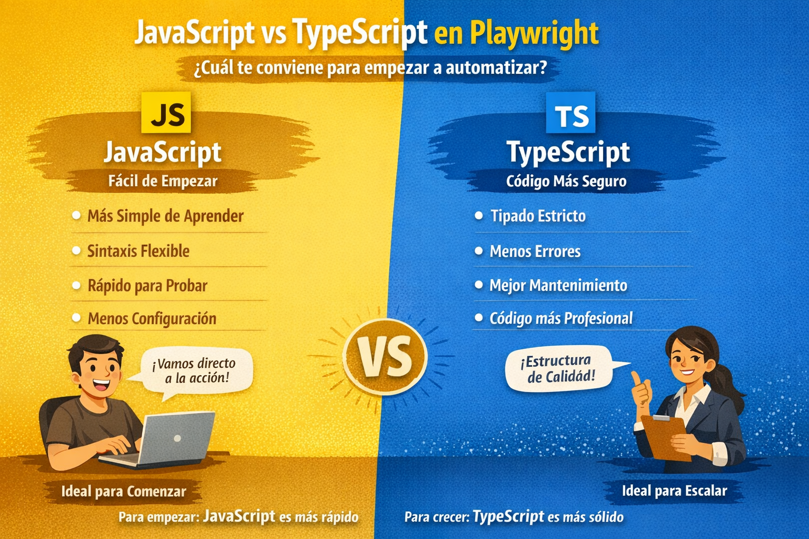
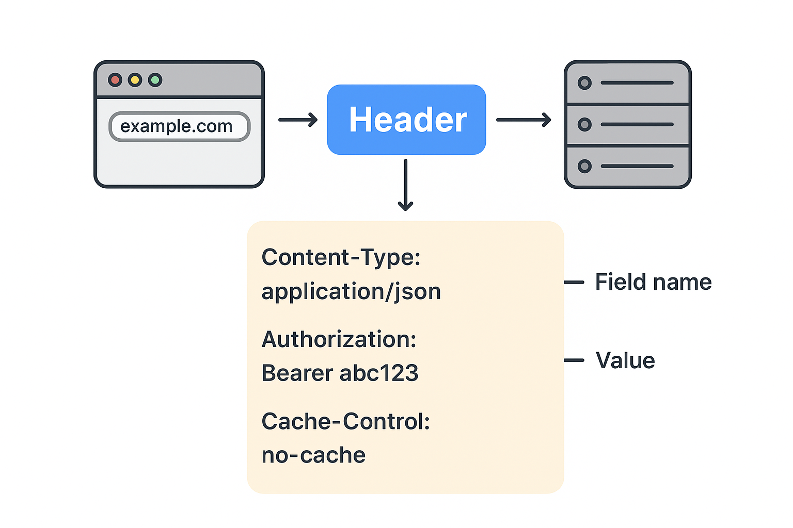

# 🌱 Warm Up #2 – JavaScript, Estructura y Peticiones Avanzadas

En este calentamiento, te prepararás para crear un proyecto completo de automatización de APIs usando **Playwright y JavaScript**. 
Dejaremos atrás las herramientas visuales como Postman para empezar a programar nuestros propios robots de prueba.

----

## 📂 Index
1. [JavaScript vs TypeScript: Nuestro camino de aprendizaje](#1-javascript-vs-typescript-nuestro-camino-de-aprendizaje) (Tiempo de lectura: 3 minutos)
2. [Anatomía de un test en Playwright](#2-anatomía-de-un-test-en-playwright) (Tiempo de lectura: 5 minutos)
3. [Manejo de variables y JSON en JS](#3-manejo-de-variables-y-json-en-js) (Tiempo de lectura/practica: 10 minutos)
4. [La naturaleza de las peticiones: GET vs POST y Headers](#4-la-naturaleza-de-las-peticiones-get-vs-post-y-headers) (Tiempo de lectura: 10 minutos)
5. [Extracción de valores de la respuesta](#5-extracción-de-valores-de-la-respuesta) (Tiempo de lectura/practica: 10 minutos)
6. [Funciones en JavaScript para dar superpoderes](#6-funciones-en-javascript-para-dar-superpoderes) (Tiempo de lectura/practica: 15 minutos)
7. [Estructura de un proyecto y Configuración Global](#7-estructura-de-un-proyecto-y-configuración-global) (Tiempo de lectura: 10 minutos)
8. [Quick Task](#8-quick-task) (Tiempo de lectura/practica: 40 minutos)

> ⏱️ **Tiempo aproximado de estudio:** 1 hora y 45 Minutos

---

## 1. JavaScript vs TypeScript: Nuestro camino de aprendizaje

Playwright soporta dos lenguajes hermanos: **JavaScript (JS)** y **TypeScript (TS)**.
Como testers, a veces nos abruma decidir cuál aprender. Aquí está el secreto:

*   **JavaScript (JS):** Es como manejar un auto automático. Es dinámico, flexible, perdona muchos errores y es rapidísimo para empezar a escribir código. **Tiene una curva de aprendizaje muy amigable para principiantes.**
*   **TypeScript (TS):** Es JS, pero con "reglas estrictas" (tipado estático). Es como manejar un auto estándar de carreras. Te obliga a definir exactamente qué tipo de dato es cada variable. Es increíble para evitar errores en proyectos gigantes.

🚀 **Nuestra Estrategia:** En este stage **usaremos JavaScript**. Queremos que te enfoques en entender cómo probar APIs, cómo fluyen los datos y cómo usar Playwright, sin que el lenguaje te ponga reglas frustrantes.

*Nota Ninja:* En el último stage de esta formación, daremos el salto a TypeScript para enseñarte cómo estructurar proyectos de nivel arquitectónico.



---

## 2. Anatomía de un test en Playwright

A diferencia de Postman donde haces clic en botones, en Playwright escribimos bloques de código que describen nuestra prueba. La estructura base siempre es la misma:

```javascript
const { test, expect } = require('@playwright/test');

// 1. Definimos el nombre del bloque de prueba
test('Validar que el API responde correctamente', async ({ request }) => {
    
    // 2. Ejecución (El equivalente a darle "Send" en Postman)
    const response = await request.get('https://api.ejemplo.com/health');
    
    // 3. Validación (Asserts)
    expect(response.status()).toBe(200);
});
```

*   `test`: Es la caja que envuelve nuestra prueba.
*   `async / await`: Las peticiones a internet toman tiempo. Estas palabras le dicen a nuestro código: *"Lanza la petición y ESPERA a que llegue la respuesta antes de seguir a la siguiente línea"*.
*   `request`: Es nuestro "Postman integrado". Con él hacemos `get()`, `post()`, `delete()`.
*   `expect`: Es nuestro juez. Se encarga de afirmar que lo que recibimos es lo correcto.

---

## 3. Manejo de Variables y JSON en JS

Las variables son la mochila del ninja: ahí guardas datos para usarlos después. En JavaScript usamos principalmente dos:
*   `const`: Para datos que **nunca van a cambiar** (como una URL base).
*   `let`: Para datos que **pueden cambiar** durante la prueba.

### Construyendo un Body (Payload)
Para crear un usuario, necesitamos enviarle a la API un JSON. En JS, esto se hace creando un "Objeto":

```javascript
test('Manejo de variables', async ({ request }) => {
    const nombreUsuario = 'Juan Perez';
    const edadUsuario = 30;

    // Armamos nuestro JSON (Payload)
    const payload = {
        name: nombreUsuario,
        age: edadUsuario,
        job: 'QA Automation'
    };

    const response = await request.post('https://api.ejemplo.com/users', {
        data: payload
    });
});
```

---

## 4. La naturaleza de las peticiones: GET vs POST y Headers

Las APIs tienen reglas estrictas sobre cómo comunicarse. Como Automation QA, debes conocer la diferencia vital entre enviar datos a leer (GET) y enviar datos a escribir (POST).

### Los Headers (Cabeceras)
Un Header es la carta de presentación de tu petición. No se ve en la pantalla, viaja oculto. Los más comunes son:
*   `Authorization`: Tu gafete VIP (Ej. `Bearer token-12345`). Sin esto, las APIs seguras te darán un error `401 Unauthorized`.
*   `Content-Type`: Le dice a la API en qué idioma le hablas (Ej. `application/json`).



### Petición POST (Crear/Modificar)
Un POST es como enviar una caja por correo. Necesita una etiqueta (Headers) y contenido dentro de la caja (Body/JSON).

```javascript
const response = await request.post('https://api.ejemplo.com/users', {
    headers: {
        'Authorization': 'Bearer mi-token-secreto',
        'Accept': 'application/json'
    },
    data: {
        "name": "Ninja QA"
    } // <-- Este es el Body en formato JSON
});
```

### Petición GET (Consultar) y los Parámetros (Params)
Un GET **NO** lleva Body (no envías cajas para pedir información). Si quieres filtrar tu búsqueda, usas **Query Parameters** (Parámetros de consulta).
Es como buscar en Amazon: `amazon.com/zapatos?color=rojo&talla=40`.

```javascript
// Playwright armará la URL así: https://api.ejemplo.com/users?rol=qa&status=active
const response = await request.get('https://api.ejemplo.com/users', {
    headers: {
        'Authorization': 'Bearer mi-token-secreto'
    },
    params: {
        "rol": "qa",
        "status": "active"
    } // <-- Parámetros de búsqueda, NO es un Body.
});
```

---

## 5. Extracción de valores de la respuesta

Casi el 99% de las APIs modernas responden en formato JSON. En Playwright, extraer datos de esa respuesta es sumamente fácil gracias a la función `.json()`.

**Flujo típico en Automatización de APIs:**
1. Haces un POST para crear algo.
2. Atrapas el `id` que la API generó.
3. Haces un GET usando ese mismo `id` para verificar que se guardó bien en la Base de Datos.

```javascript
test('Extraer ID y encadenar peticiones', async ({ request }) => {
    
    // 1. Creamos el usuario
    const postResponse = await request.post('https://api.ejemplo.com/users', {
        data: { name: 'Ninja' }
    });
    
    // Transformamos la respuesta binaria a un JSON de JavaScript
    const responseBody = await postResponse.json(); 
    
    // Navegamos por el JSON usando puntos (.)
    const nuevoUserId = responseBody.data.id; 
    console.log('ID Extraído:', nuevoUserId);

    // 2. Usamos el ID dinámico en el siguiente GET
    const getResponse = await request.get(`https://api.ejemplo.com/users/${nuevoUserId}`);
    expect(getResponse.status()).toBe(200);
});
```

---

## 6. Funciones en JavaScript para dar superpoderes

Si en tu prueba intentas crear el usuario `ninja@qaxpert.com` dos veces, la API fallará (Error 400: El correo ya existe).
Para evitar esto, usamos funciones en JavaScript que generen datos dinámicos.

En lugar de escribir la función en el mismo archivo del test, creamos un archivo separado llamado `utils.js` (esto se llama **Modularidad**).

**Archivo: `utils.js`**
```javascript
// Creamos la función
function generarEmailAleatorio() {
    const timestamp = Date.now(); // Genera un número único basado en la hora exacta
    return `ninja_${timestamp}@qaxpert.com`;
}

// La exportamos para que otros archivos la puedan usar
module.exports = { generarEmailAleatorio };
```

**Archivo de prueba: `api.spec.js`**
```javascript
const { test, expect } = require('@playwright/test');
// Importamos nuestra función al inicio del archivo
const { generarEmailAleatorio } = require('./utils'); 

test('Crear usuario con email dinámico', async ({ request }) => {
    const emailDinamico = generarEmailAleatorio(); // Ej: ninja_169000213@qaxpert.com
    
    const response = await request.post('https://api.ejemplo.com/users', {
        data: { 
            name: "QA",
            email: emailDinamico 
        }
    });
    expect(response.status()).toBe(201);
});
```
> ✅ **Buena Práctica:** Archiva toda la lógica de cálculo, generación de fechas o formateo en archivos `utils.js`. Tus archivos `.spec.js` deben quedar limpios, enfocados solo en enviar datos y validar respuestas.

---

## 7. Estructura de un Proyecto y Configuración Global

Un Ninja no tira sus armas por el suelo del Dojo. Todo tiene un lugar. A medida que tus pruebas crecen, necesitas una estructura escalable:

```bash
playwright-api-project/
├── tests/                   # Aquí viven todos tus archivos .spec.js
│   ├── login.spec.js
│   └── users.spec.js
├── utils/                   # Funciones JS reutilizables
│   └── dataHelpers.js
├── data/                    # JSONs con datos masivos para pruebas
│   └── testData.json
├── playwright.config.js     # EL CORAZÓN DE LA CONFIGURACIÓN
├── package.json             # Dependencias de Node.js
└── .gitignore               # Para no subir basura a GitHub
```

### La magia del `playwright.config.js`
Imagina tener 50 pruebas y en todas escribir `https://misistema-qa.com/api/v1/users`. Si mañana el servidor cambia a `misistema-dev.com`, ¡tendrías que editar 50 archivos a mano!

Para evitar eso, usamos la configuración global de Playwright.

**En el archivo `playwright.config.js`:**
```javascript
module.exports = {
  use: {
    // Definimos la URL base una sola vez para todo el proyecto
    baseURL: 'https://practice.expandtesting.com/notes/api',
    
    // Podemos incluso mandar Headers automáticos en todas las peticiones
    extraHTTPHeaders: {
      'Accept': 'application/json',
    },
  },
};
```

**En tu archivo de prueba (`.spec.js`):**
```javascript
// Playwright automáticamente agregará el baseURL por detrás.
// ¡Tu código queda súper limpio!
const response = await request.post('/users/register', { ... });
```

---

## 8. Quick Task

### Ejercicio

1. Crea un proyecto nuevo e inicializa Playwright (`npm init playwright@latest`).
2. Crea un archivo `utils.js` e inventa una función en JavaScript que genere un `username` único (puedes usar `Math.random()` o `Date.now()`). Expórtala.
3. Crea un test en Playwright que importe esa función.
4. En el test, realiza un `POST` a una API pública (puedes usar JSONPlaceholder o la API de Notes del Stage 1) enviando el nombre de usuario generado.
5. Extrae el `id` u otro dato de la respuesta del JSON y muéstralo en consola usando `console.log()`.
6. Valida que el status sea el esperado (`200` o `201`).

#### Entrega
- Sube tu código a tu repositorio personal de GitHub.
- Menciona a tu mentor en un Pull Request para que pueda revisar tu código y darte

### Quizz
- [Completa el quizz](https://gemini.google.com/share/5c989ca19d02) de 20 preguntas del contenido del Warm Up (solo un intento) y comparte el resultado en el grupo de WhatsApp programa de mentoría QAX.
- Toma un screenshot de tu resultado y compártelo en el grupo de WhatsApp del programa de mentoría QAXPERT.
---

> **Si te sientes perdido:** No pasa nada, inténtalo de todos modos. 
> Equivócate, rompe el código – ¡no siempre sale a la primera! Usa la IA (ChatGPT, Grok), 
> busca en la documentación de Playwright o en Google.

Luego, asiste a nuestra **próxima mentoría de seguimiento**. Muéstranos tu avance (aunque esté roto), y ahí te guiamos paso a paso.
Te acompañamos, pero también te retamos porque **sabemos de lo que eres capaz, Ninja.** 🥷

---

### 👈 Volver al [Stage 2](../README.md)

